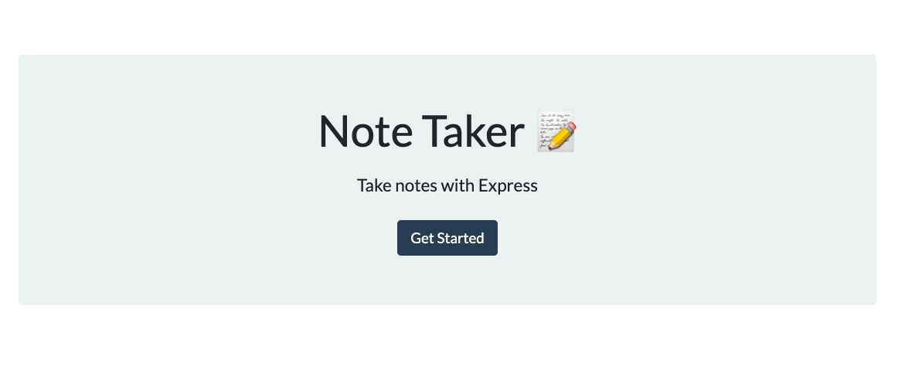
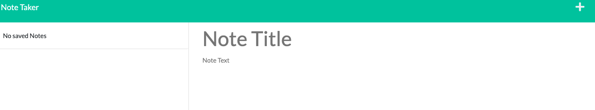

# Custom NoteTaker

## Table of Contents

1. [Description](#description)
2. [Visuals](#visuals)
3. [Deployment](#deployment)

## Description

This application was created using Express.js. It is deployed to Heroku. The NoteTaker gives the user the ability to take notes with titles that they can save and refer to later on.

## Visuals

## Deployment

[> Link to GitHub Repo <](https://github.com/slwooten/custom-notetaker)
